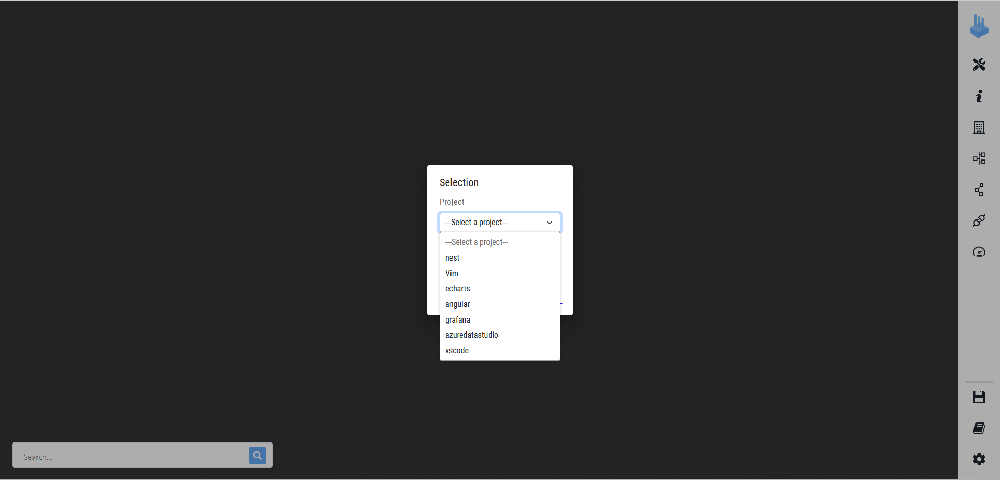
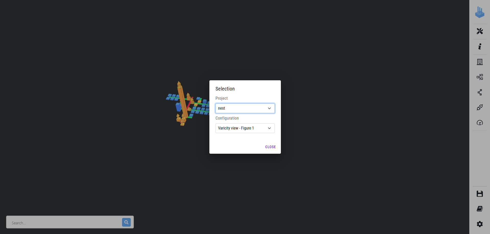
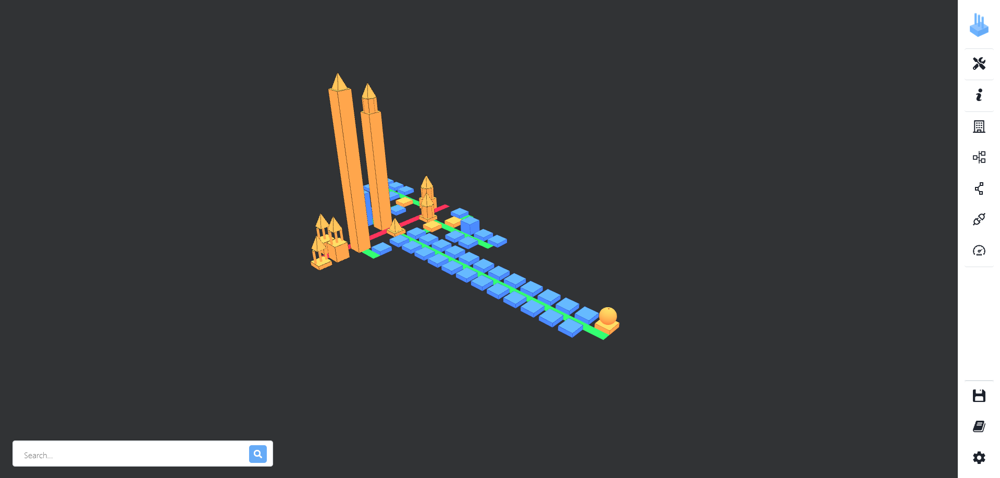

# VariCity-TS

<p align="center">

</p>

**VariCity-TS** is a 3D visualization relying on the city metaphor to display zones of high density of variability
implementations in a single system. The city is built by creating buildings, corresponding to classes, and streets,
grouping every class linked to the street's starting building.

**VariCity-TS-backend** interacts with the File System and combines the JSON generated by Symfinder-TS. It also manages the saving and loading of configuration files.

**Symfinder-TS** is a toolchain parsing a single TypeScript codebase to identify potential variability implementations.
The output of Symfinder-TS can consist of JSON files containing information on the presence of variability implementations in the analyzed codebase (e.g. if a class has been identified as a variation point or a variant, the number of variants of an identified variation point…).

## How to run the demo

The following demo will use the [Nest](https://github.com/nestjs/nest) project as an example.
1. The first step will be a variability analysis performed by Symfinder-TS.
2. The JSONs created will automatically be sent to the VariCity-TS-Backend
3. The VariCity-TS-Backend will parse all the JSONs to regroup all the metrics and node data.
5. Using the VariCity-TS UI you will be able to visualize the city of Nest.


### General Requirements

You need a functional Docker setup to be able to run the project.

Instructions on Docker installation or on how to build the Docker images **only if you want to modify the source code** are included in the `REQUIREMENTS.md`file in this folder.

### Run VariCity-TS

The following Docker images hosted on the [Docker Hub](https://hub.docker.com/u/deathstar3) allow you to use symfinder-TS without needing to build it.

```
deathstar3/symfinder-ts-cli
deathstar3/varicity-ts
deathstar3/varicity-ts-backend
```

- First, run the VariCity-TS server:

  - On GNU/Linux

  ```
  ./run-compose.sh
  ```

- Then, in another terminal:

  - On GNU/Linux

  ```
  ./run_symfinder_ts.sh https://github.com/nestjs/nest -runner docker -http http://varicity-backend:3000/projects 
  ```

- Open your web browser and go to [http://localhost:8000](http://localhost:8000)
- Click on the `Project` dropdown menu. A list of the available projects appears.

- By clicking on the desired project name, here Nest, a pre-configured view appears in the background. You can choose the view you want by clicking on the second dropdown menu.

- The `dockervolume/configs` directory contains a directory for each project, containing several pre-configured views. The Nest configuration is labeled under `Varicity view - Figure 1`.
- By clicking on the view `Varicity view - Figure 1`, the city is loaded.

-The visualization above shows Nest with usage orientation set to OUT and usage level set to 2.

>Please note that the visualization may not be centered when appearing. The rendering time of the visualization increases with the number of buildings to display.
>To limit the loading time when switching between projects, we advise reducing the value of the usage level to limit the number of buildings to render before switching.

## Documentation
- [Go to Symfinder-TS documentation](./symfinder/README.md)
- [Go to VariCity-TS documentation](./varicity/README.md)
- [Go to VariCity-TS-backend documentation](./varicity-backend/README.md)
