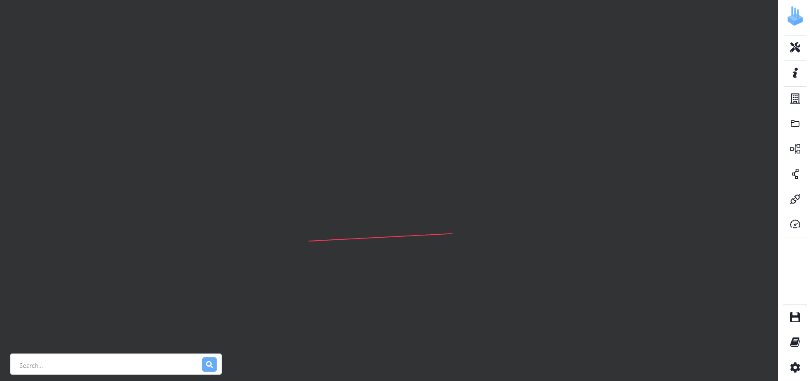

<p align="center">

</p>

# IMPORTANT MESSAGE

The code on this Main branch is the source code of the tool **2Cities** which was presented at SPLC'24.  
**This version focuses on identifying and visualizing variability implemented with Object-Oriented mechanisms and code clones in TypeScript systems.**  
Two papers were published at SPLC'24, one short research paper presenting the approach, available at [this link](https://hal.science/hal-04717839), and a tool demo paper addressing the conception of the tool, available at [this link](https://hal.science/hal-04717872).

A previous version, **focusing only on variability implemented with Object-Oriented mechanisms** is also available among released versions in this repository and is tagged `VariCity-TS`.  
This version is part of the VariCity ecosystem, presented in a journal article for SCP 2025, available at [this link](https://hal.science/hal-04725549).


# 2Cities
**2Cities** is a 3D visualization relying on the city metaphor to display variability implemented with multiple types of variability implementation mechanisms in a single system.   
The first city, _CloneCity_, aims at visualizing variability implemented by using structural patterns, with modules and file duplications, and code duplication.
Thus _CloneCity_ visualizes the whole project structure, and is built by creating building corresponding to files, and folders as streets.  
The second city _ObjectCity_ reuses the existing solution [_VariCity_](https://github.com/DeathStar3/varicity) and its principles. The city is built by creating buildings, corresponding to classes, and streets, grouping every class linked to the street's starting building.

**VariCity-backend** interacts with the File System and combines the JSON generated by _Symfinder-TS_. It also manages the saving and loading of configuration files.

**Symfinder-TS** is a toolchain parsing a single TypeScript codebase to identify potential variability implementations.
The output of _Symfinder-TS_ can consist of JSON files containing information on the presence of variability implementations in the analyzed codebase (e.g. if a class has been identified as a variation point or a variant, the number of variants of an identified variation point…).

Finally, **cloneFinder** is a toolchain parsing results of a code clone detection and combines it with the detection data of _Symfinder-TS_.
The code clone detection is operated by the existing solution, _MSCCD_, and focuses on Type 3 clones.

## Video demo 

If you just want to see how the tool works without performing a full run, you can watch this [short video](https://youtu.be/tMxa1_q5fq4).

## How to use 2Cities visualization

### Run 2Cities on your project

If you want to perform a full run of the tool on your project you can follow the steps of this demo.

1. The first step will be a variability analysis performed by Symfinder-TS.
2. Then, the code clone detection (CCD) is run by MSCCD on the project.
3. Finally, cloneFinder parses the CCD results to complete detection data from the _Symfinder-TS_ analysis.
4. Using the 2Cities UI you will be able to visualize the 2Cities of your project.


### General Requirements

You need a functional Docker setup to be able to run the project.

Instructions on Docker installation or on how to build the Docker images **only if you want to modify the source code** are included in the `REQUIREMENTS.md`file in this folder.

### Instructions

The following Docker images hosted on the [Docker Hub](https://hub.docker.com/u/deathstar3) allow you to use the complete toolchain without needing to build it.

```
deathstar3/symfinder-ts-cli
deathstar3/varicity-ts
deathstar3/varicity-ts-backend
deathstart3/msccd (super heavy image ! More than 3Gb)
deathstar3/clonefinder-cli
```

- First, run the 2Cities server:

  - On GNU/Linux

  ```
  ./run_twocities.sh
  ```

- Then, in another terminal run the Symfinder-TS analysis:

  - On GNU/Linux

  ```
  ./run_symfinder_ts.sh your_Github_URL -runner docker
  ```

- Next is the code clone detection. Once the Symfinder-TS analysis is done:

  - First, you need to create a configuration file. Starting from the project root, create the file in the folder _MSCCD_config_ at this path `/tasks_volume/MSCCD_config/`
  - The file name must follow this structure `projectName.config.json`.

  - Here is the structure for the configuration file.
      ```
      {
        "inputProject": ["./experiments_volume/projectName/mainFolder"],
        "keywordsList": "./MSCCD/grammarDefinations/TypeScript/TypeScript.reserved",
        "languageExtensionName":[".ts"],
        "minTokens": 10,
        "minTokensForBagGeneration": 10,
        "detectionThreshold": 0.5,
        "maxRound": 1,
        "tokenizer": "TypeScript",
        "threadNum_tokenizer": 20,
        "threadNum_detection": 20
      } 
      ```
    
  - You **must** change the _projectName_ and _mainFolder_ in the _inputProject_ path. Please note that it is case-sensitive.

  - Then it is up to you to modify the _minTokens_ and _minTokensForBagGeneration_. They impact the size of code fragments detected. You can also change the detection threshold.
  For more information please refer to the [MSCCD repository](https://github.com/zhuwq585/MSCCD)

  - Once completed, you can run the code clone detection

    - On GNU/Linux

      ```
        ./run_ccd.sh project_name
      ```

      - Please replace the _project_name_ with the name of your project. Please note it is also case-sensitive.

  - Once the analysis is done, follow these steps:

    - Open your web browser and go to [http://localhost:8000](http://localhost:8000)

    - Click on the `Project` dropdown menu. Select the name of your project.

    - Once loaded you will only see a red road.
    

    >Please note that the visualization may not be centered when appearing. The rendering time of the visualization increases with the number of buildings to display.

  ### Exploring your city

  Once the visualization is up, you can explore the city by moving the camera with the following controls:

  - Left mouse button: Drag to turn the camera
  - Right mouse button: Drag to move the camera, horizontally  and vertically
  - Scroll up/down: Zoom in/out

  _Note that if you zoom in too much, the city might disappear. In this case scroll back and drag your camera to a better angle to zoom further in._

  - By using the entrypoints menu on the right side (following picture) you can add entrypoints for each city.

  

  - Entrypoints for ObjectCity have to be inputted in the `API classes` menu and those for CloneCity in the `API files` menu.

  - In CloneCity, folders are streets and files are the districts along the road. 
  - Colored files are duplicated files used to implement variability with modules.
  - Shades topping files represent code duplication. The higher the shade the more duplication.
  - Please refer to the [VariCity documentation](./varicity/README.md) to understand how to explore ObjectCity.

  


## Documentation
- [Go to Symfinder-TS documentation](./symfinder/README.md)
- [Go to VariCity documentation](./varicity/README.md)
- [Go to VariCity-TS-backend documentation](./varicity-backend/README.md)
