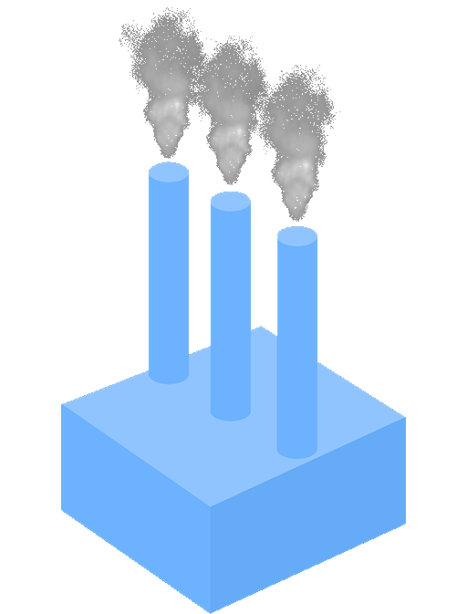

# VariCity-Config

<p align="center">

</p>

**VariCity** is a 3D visualization relying on the city metaphor to display zones of high density of variability
implementations in a single system. The city is built by creating building, corresponding to classes, and streets,
grouping every class linked to the street's starting building.

**VariCity-backend** interact with the File System and combine the JSON generated by SymFinder and the JSON files for external metrics. It also manages the saving and loading of configurations files.

**SymFinder** is a toolchain parsing a single Java codebase to identify potential variability implementations.
The output of SymFinder consists in JSON files containing information on the presence of variability implementations in the analysed codebase (e.g. if a class has been identified as a variation point or a variant, number of variants of an identified variation point…).

**Metrics-extension** is a tool allowing you to retrieve additional metrics from external sources. It can be configured to retrieve quality metrics from SonarCloud given a URL, or can automatically pull a local SonarQube image to scan the given project.

**SymFinder-CLI** orchestrate the gathering of variability & quality metrics by running the Metric-Extension and Symfinder tools. They are called depending on configuration files and parameters given by the user.

## How to run the demo

The following demo will use the JUnit project with a custom ``pom.xml`` to build the project with coverage.
1. The first step will be a variability analysis performed by Symfinder.
2. After that we will retrieve five extra quality metrics using a local SonarQube generated container. 
   * Quality metrics to be gathered: complexity, cognitive_complexity, coverage, duplicated_lines and duplicated_lines_density.
3. The JSONs created will automatically be sent to the VariCity-Backend
4. The VariCity-Backend will parsed all the JSONs to regroup all the metrics and node data.
5. Using the VariCity UI you will be able to visualize the city of JUnit.


### General Requirements

- Node 16.0
- NPM 7.10
- Docker (CLI and deamon)
  - Instructions to install Docker are available [here](https://docs.docker.com/get-docker/).
- Docker-compose
  - Instructions to install Docker Compose are available [here](https://docs.docker.com/compose/install/#install-compose).
- JDK 11 (if you want to develop the `metrics-extension` project)
  - The JAVA_HOME environment variable must be defined and pointing to a JDK >= 11 (if you want to run Symfinder directly on the host)
- Maven
- Internet connexion
  - To pull docker images
- Free disk space over 15 GB (To download the images and also because Sonarqube exits when disk space is low)

**Note:** By default, on a GNU/Linux host, Docker commands must be run using `sudo`.
Two options are available for you in order to run the project:
- Follow [these short steps](https://docs.docker.com/install/linux/linux-postinstall/#manage-docker-as-a-non-root-user) to allow your user to call Docker commands,
- Preface the scripts calls with `sudo`.

### Procedure

Build docker images
```shell
./build-docker-images.sh
```

```bat
./build-docker-images.bat
```

Run visualization
```shell
./run-compose.sh
```

```bat
./run-compose.bat
```

Run the analysis
```shell
./run-docker-cli.sh -i /data/junit-r4.13.2-config.yaml -s /data/symfinder.yaml -verbosity INFO -http http://varicityback:3000/projects
```

```bat
./run-docker-cli.bat -i /data/junit-r4.13.2-config.yaml -s /data/symfinder.yaml -verbosity INFO -http http://varicityback:3000/projects
```


Open your browser and go to [http://localhost:8000](http://localhost:8000) and select jour project. 
No worries if no city is displayed, go to the "APIs and Blacklist" menu on the right to define your entry points.

## Documentation
- [Go to symfinder's documentation](./metrics-extension/symfinder/README.md)
- [Go to metrics-extension's documentation](./metrics-extension/README.md)
- [Go to varicity-backend's documentation](./varicity-backend/README.md)
- [Go to varicity's documentation](./varicity/README.md)

## Authors

Authors | Contact
----------------------------------------------------------- | ----------------------------------------------------------
[Patrick Anagonou](https://github.com/anagonousourou)       | [sourou-patrick.anagonou@etu.univ-cotedazur.fr](mailto:sourou-patrick.anagonou@etu.univ-cotedazur.fr)
[Guillaume Savornin](https://github.com/GuillaumeSavornin)  | [guillaume.savornin@etu.univ-cotedazur.fr](mailto:guillaume.savornin@etu.univ-cotedazur.fr)
[Anton van der Tuijn](https://github.com/Anton-vanderTuijn) | [anton.van-der-tuijn@etu.univ-cotedazur.fr](mailto:anton.van-der-tuijn@etu.univ-cotedazur.fr)

