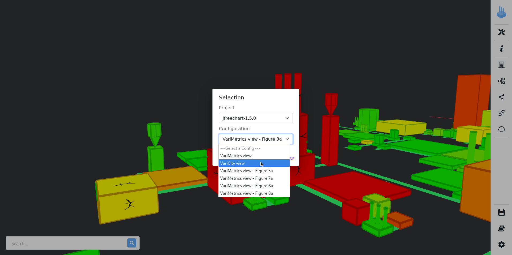

# Installation instructions

In this document, we assume that you already have a system with:
- a fully functional Docker and Docker Compose install;
- a web browser (our tests have been made with Google Chrome, Mozilla Firefox, and Safari).

See REQUIREMENTS.md file for more details.

## Running VariMetrics

All the scripts in this section are located and executed from the root of the project.

### Reusing the existing Docker image

VariMetrics is available as a Docker image hosted on the [Docker Hub](https://hub.docker.com/r/deathstar3/varicity),
allowing to use it without needing to build it.

Run VariMetrics by running


- On GNU/Linux and macOS

    ```
    ./run-compose.sh
    ```

- On Windows

    ```
    run-compose.bat
    ```

*Note:* Docker automatically downloads the image with the `splc2022` tag if it is not found on the host system. TOUPDATE

You can also download it manually with:
```
docker pull deathstar3/varicity:splc2022
```

VariMetrics is a NodeJS application written in TypeScript deployed in a webpack environment.
The Docker container exposes the application as a server, which is accessed through your web browser.

### Building VariMetrics

**This step is only needed if you edited VariMetrics's source code.**

You can build VariMetrics's Docker images by going in the `/varicity` directory and running

```
./build.sh
```

Then, run symfinder using the local images that you just built. TOUPDATE

```
./varicity.sh --local
```

*Note:* Due to end of lines problems on Windows, building the Docker images is only possible if you use a GNU/Linux or macOS system. TOUPDATE

### Checking that VariMetrics works

- Two Docker containers start: `varicity` and `varicity-backend`. TOUPDATE
```
$ ./run-compose.sh
resources directory already exists
data directory already exists
dockervolume directory already exists
[+] Running 2/0
 ⠿ Container varicity-backend  Created                                                                                                                                                                                                  0.0s
 ⠿ Container varicity          Created                                                                                                                                                                                                  0.0s
Attaching to varicity, varicity-backend
varicity          | /docker-entrypoint.sh: /docker-entrypoint.d/ is not empty, will attempt to perform configuration
varicity          | /docker-entrypoint.sh: Looking for shell scripts in /docker-entrypoint.d/
varicity          | /docker-entrypoint.sh: Launching /docker-entrypoint.d/10-listen-on-ipv6-by-default.sh
varicity          | 10-listen-on-ipv6-by-default.sh: info: IPv6 listen already enabled
varicity          | /docker-entrypoint.sh: Launching /docker-entrypoint.d/20-envsubst-on-templates.sh
varicity          | /docker-entrypoint.sh: Launching /docker-entrypoint.d/30-tune-worker-processes.sh
varicity          | /docker-entrypoint.sh: Configuration complete; ready for start up
varicity          | 2022/06/06 14:13:20 [notice] 1#1: using the "epoll" event method
varicity          | 2022/06/06 14:13:20 [notice] 1#1: nginx/1.20.2
varicity          | 2022/06/06 14:13:20 [notice] 1#1: built by gcc 10.3.1 20210424 (Alpine 10.3.1_git20210424) 
varicity          | 2022/06/06 14:13:20 [notice] 1#1: OS: Linux 5.17.9-arch1-1
varicity          | 2022/06/06 14:13:20 [notice] 1#1: getrlimit(RLIMIT_NOFILE): 1048576:1048576
varicity          | 2022/06/06 14:13:20 [notice] 1#1: start worker processes
varicity          | 2022/06/06 14:13:20 [notice] 1#1: start worker process 25
varicity          | 2022/06/06 14:13:20 [notice] 1#1: start worker process 26
varicity          | 2022/06/06 14:13:20 [notice] 1#1: start worker process 27
varicity          | 2022/06/06 14:13:20 [notice] 1#1: start worker process 28
varicity          | 2022/06/06 14:13:20 [notice] 1#1: start worker process 29
varicity          | 2022/06/06 14:13:20 [notice] 1#1: start worker process 30
varicity          | 2022/06/06 14:13:20 [notice] 1#1: start worker process 31
varicity          | 2022/06/06 14:13:20 [notice] 1#1: start worker process 32
varicity          | 2022/06/06 14:13:20 [notice] 1#1: start worker process 33
varicity          | 2022/06/06 14:13:20 [notice] 1#1: start worker process 34
varicity          | 2022/06/06 14:13:20 [notice] 1#1: start worker process 35
varicity          | 2022/06/06 14:13:20 [notice] 1#1: start worker process 36
varicity-backend  | 
varicity-backend  | > varicity-backjs@0.0.1 start:prod
varicity-backend  | > node dist/main
varicity-backend  | 
varicity-backend  | [Nest] 18  - 06/06/2022, 2:13:20 PM     LOG [NestFactory] Starting Nest application...
varicity-backend  | [Nest] 18  - 06/06/2022, 2:13:20 PM     LOG [InstanceLoader] ConfigHostModule dependencies initialized +28ms
varicity-backend  | [Nest] 18  - 06/06/2022, 2:13:20 PM     LOG [InstanceLoader] ConfigModule dependencies initialized +0ms
varicity-backend  | [Nest] 18  - 06/06/2022, 2:13:20 PM     LOG [InstanceLoader] AppModule dependencies initialized +2ms
varicity-backend  | [Nest] 18  - 06/06/2022, 2:13:20 PM     LOG [RoutesResolver] ProjectController {/}: +167ms
varicity-backend  | [Nest] 18  - 06/06/2022, 2:13:20 PM     LOG [RouterExplorer] Mapped {/projects/names, GET} route +2ms
varicity-backend  | [Nest] 18  - 06/06/2022, 2:13:20 PM     LOG [RouterExplorer] Mapped {/projects/json/:name, GET} route +1ms
varicity-backend  | [Nest] 18  - 06/06/2022, 2:13:20 PM     LOG [RouterExplorer] Mapped {/projects/:name/metrics/external, GET} route +0ms
varicity-backend  | [Nest] 18  - 06/06/2022, 2:13:20 PM     LOG [RouterExplorer] Mapped {/projects/:name/metrics/variability, GET} route +0ms
varicity-backend  | [Nest] 18  - 06/06/2022, 2:13:20 PM     LOG [RouterExplorer] Mapped {/projects/:name/metrics, GET} route +1ms
varicity-backend  | [Nest] 18  - 06/06/2022, 2:13:20 PM     LOG [RouterExplorer] Mapped {/projects, POST} route +0ms
varicity-backend  | [Nest] 18  - 06/06/2022, 2:13:20 PM     LOG [RoutesResolver] ConfigController {/}: +1ms
varicity-backend  | [Nest] 18  - 06/06/2022, 2:13:20 PM     LOG [RouterExplorer] Mapped {/projects/configs, POST} route +0ms
varicity-backend  | [Nest] 18  - 06/06/2022, 2:13:20 PM     LOG [RouterExplorer] Mapped {/projects/configs/:configFile, POST} route +1ms
varicity-backend  | [Nest] 18  - 06/06/2022, 2:13:20 PM     LOG [RouterExplorer] Mapped {/projects/configs/names, GET} route +0ms
varicity-backend  | [Nest] 18  - 06/06/2022, 2:13:20 PM     LOG [RouterExplorer] Mapped {/projects/:projectName/configs, GET} route +1ms
varicity-backend  | [Nest] 18  - 06/06/2022, 2:13:20 PM     LOG [RouterExplorer] Mapped {/projects/configs/path, GET} route +0ms
varicity-backend  | [Nest] 18  - 06/06/2022, 2:13:20 PM     LOG [RouterExplorer] Mapped {/projects/configs, GET} route +1ms
varicity-backend  | [Nest] 18  - 06/06/2022, 2:13:20 PM     LOG [RouterExplorer] Mapped {/projects/configs/firstOrDefault, GET} route +0ms
varicity-backend  | [Nest] 18  - 06/06/2022, 2:13:20 PM     LOG [RouterExplorer] Mapped {/projects/:projectName/configs/filenames-and-names, GET} route +0ms
varicity-backend  | [Nest] 18  - 06/06/2022, 2:13:20 PM     LOG [NestApplication] Nest application successfully started +16ms
```
- Once the `Nest application successfully started` log appears, you can now open your web browser and go to `http://localhost:8000`.
- A page appears, showing the list of the available projects.
  
- By clicking on the desired project's name, you can then select the configuration you want to visualize while a first visualization is loading, here JFreeChart.
  Please note that the visualization may not be centered when appearing. The rendering time of the visualization increases with the number of buildings to display.
  To limit the loading time when switching between projects, we advise to reduce the value of the usage level to limit the number of buildings to render.

  
- By selecting the `VariMetrics view` configuration, we obtain the following view:
  

## Running symfinder

Reproducing the pre-generated visualizations is done by executing their analysis before VariMetrics.
All scripts used in this section are located in the artifact's root directory.

### Reusing the existing Docker images TOUPDATE

The following Docker images hosted on the [Docker Hub](https://hub.docker.com/) allow to use symfinder without needing to build it.
```
deathstar3/symfinder-fetcher
deathstar3/symfinder-neo4j
deathstar3/symfinder-engine
deathstar3/symfinder-runner
```

The configuration files for all 7 projects presented in the paper are available in the `/data` directory.
- `azureus.yaml` → [Azureus 5.7.6.0](https://github.com/Corpus-2021/Azureus/tree/5.7.6.0)
- `geotools.yaml` → [GeoTools 23.5](https://github.com/Corpus-2021/geotools/tree/23.5-AnalysisReady)
- `jdk.yaml` → [JDK 17-10](https://github.com/Corpus-2021/jdk/tree/17-10-AnalysisReady)
- `jfreechart-1.5.0.yaml` → [JFreeChart 1.5.0](https://github.com/DeathStar3/jfreechart)
  - `jfreechart-refactored.yaml` → [JFreeChart 1.5.0](https://github.com/DeathStar3/jfreechart/tree/refactor) after the maintenance actions studied in section 5.2
- `jkube.yaml` → [JKube 1.7.0](https://github.com/eclipse/jkube)
- `openapi-generator.yaml` → [OpenAPI Generator 5.4.0](https://github.com/OpenAPITools/openapi-generator)
- `spring.yaml` → [Spring framework 5.2.3](https://github.com/Corpus-2021/spring-framework/tree/5.2.13-AnalysisReady)

Running the analysis of one project is done as follows, here illustrated with the `/data/jfreechart-1.5.0.yaml` file:

- First, run the VariCity backend as detailed in [the section on VariMetrics](#running-varimetrics).

- Then, in another terminal:

  - On GNU/Linux and macOS

  ```
  ./run-docker-cli.sh -i /data/jfreechart-1.5.0.yaml -s /data/symfinder.yaml -verbosity INFO -http http://varicityback:3000/projects
  ```

  - On Windows

  ```
  run-docker-cli.bat -i /data/jfreechart-1.5.0.yaml -s /data/symfinder.yaml -verbosity INFO -http http://varicityback:3000/projects
  ```

*Notes:*
- Some analyses, such as the JDK, GeoTools or Azureus can take multiple hours.
More details about the analyzed projects and their definition are given in the "Using symfinder on your project" section in the README present in the artifact's root directory.
- The Docker images are automatically downloaded by Docker with the tag `splc2022` if they are not found on the host system.
If an image is not found, you can download it manually with the `docker pull` command.

Example:
```
docker pull deathstar3/symfinder-fetcher:splc2022
```

### Building symfinder

**This step is only needed if you edited symfinder's source code.**

You can build symfinder's Docker images by running

```
./build.sh
```

Then, run symfinder using the local images that you just built.

```
./run.sh --local
```

### Checking that symfinder works
Hereafter, we illustrate the different steps of the execution of symfinder by giving excerpts of console outputs corresponding to the execution of symfinder on a single project, JFreeChart.

1. First, symfinder creates the directories containing the analyzed project(s) sources and generated visualization files,
and clones the directory of the analyzed project(s), checking out the desired tags/commits.
```
$ ./run.sh jfreechart
resources directory already exists
generated_visualizations directory already exists
Using splc2022 images
Cloning into 'resources/jfreechart'...
Note: switching to 'tags/v1.5.0'.

You are in 'detached HEAD' state. You can look around, make experimental
changes and commit them, and you can discard any commits you make in this
state without impacting any branches by switching back to a branch.

If you want to create a new branch to retain commits you create, you may
do so (now or later) by using -c with the switch command. Example:

  git switch -c <new-branch-name>

Or undo this operation with:

  git switch -

Turn off this advice by setting config variable advice.detachedHead to false

HEAD is now at fd72df7c Prepare for 1.5.0 release.
HEAD is now at fd72df7c Prepare for 1.5.0 release.
```
2. Then, the `symfinder-runner` container starts, and creates two other Docker containers:
  - `symfinder-neo4j`, a Neo4j database used to store information about the analyzed project (classes, methods, identified variation points and variants…)
  - `symfinder`, being the symfinder engine which parses the codebase of the project and populates the Neo4j database.
```
Creating network "varicity-develop_default" with the default driver
Creating symfinder-runner ... done
Attaching to symfinder-runner
symfinder-runner | Cleaning previous execution...
symfinder-runner | Removing network default_default
symfinder-runner | Network default_default not found.
symfinder-runner | Creating network "default_default" with the default driver
symfinder-runner | Creating symfinder-neo4j ... 
symfinder-runner | Creating symfinder-neo4j ... done
symfinder-runner | Creating symfinder       ... 
symfinder-runner | Creating symfinder       ... done
symfinder-runner | Attaching to symfinder-neo4j, symfinder
symfinder-runner | symfinder-neo4j | Changed password for user 'neo4j'.
symfinder-runner | symfinder    | WARNING: sun.reflect.Reflection.getCallerClass is not supported. This will impact performance.
symfinder-runner | symfinder    | Jul 30, 2021 9:16:05 AM org.neo4j.driver.internal.logging.JULogger info
symfinder-runner | symfinder    | INFO: Direct driver instance 1489933928 created for server address neo4j:7687
symfinder-runner | symfinder    | 09:16:05.503 [main] MY_LEVEL Symfinder - Symfinder version: 84ef141e60a9414c842e35abdfb5303dc9a204cf
symfinder-runner | symfinder-neo4j | Directories in use:
symfinder-runner | symfinder-neo4j |   home:         /var/lib/neo4j
symfinder-runner | symfinder-neo4j |   config:       /var/lib/neo4j/conf
symfinder-runner | symfinder-neo4j |   logs:         /logs
symfinder-runner | symfinder-neo4j |   plugins:      /plugins
symfinder-runner | symfinder-neo4j |   import:       /var/lib/neo4j/import
symfinder-runner | symfinder-neo4j |   data:         /var/lib/neo4j/data
symfinder-runner | symfinder-neo4j |   certificates: /var/lib/neo4j/certificates
symfinder-runner | symfinder-neo4j |   run:          /var/lib/neo4j/run
symfinder-runner | symfinder-neo4j | Starting Neo4j.
symfinder-runner | symfinder    | Waiting for Neo4j database to be ready...
symfinder-runner | symfinder-neo4j | 2021-07-30 09:16:06.028+0000 INFO  ======== Neo4j 4.0.3 ========
symfinder-runner | symfinder-neo4j | 2021-07-30 09:16:06.033+0000 INFO  Starting...
symfinder-runner | symfinder    | Waiting for Neo4j database to be ready...
symfinder-runner | symfinder-neo4j | 2021-07-30 09:16:13.356+0000 INFO  Called db.clearQueryCaches(): Query cache already empty.
symfinder-runner | symfinder-neo4j | 2021-07-30 09:16:13.404+0000 INFO  Bolt enabled on 0.0.0.0:7687.
symfinder-runner | symfinder-neo4j | 2021-07-30 09:16:13.405+0000 INFO  Started.
symfinder-runner | symfinder-neo4j | 2021-07-30 09:16:13.972+0000 INFO  Remote interface available at http://0.0.0.0:7474/
symfinder-runner | symfinder    | 09:16:15.780 [main] MY_LEVEL Symfinder - ClassesVisitor
symfinder-runner | symfinder    | 09:16:16.300 [main] INFO  visitors.SymfinderVisitor - Visitor: visitors.ClassesVisitor - Class: org.jfree.chart.ui.StrokeChooserPanel
symfinder-runner | symfinder    | 09:16:17.045 [main] INFO  visitors.SymfinderVisitor - Visitor: visitors.ClassesVisitor - Class: org.jfree.chart.ui.ApplicationFrame
symfinder-runner | symfinder    | 09:16:17.228 [main] INFO  visitors.SymfinderVisitor - Visitor: visitors.ClassesVisitor - Class: org.jfree.chart.ui.FontChooserPanel
symfinder-runner | symfinder    | 09:16:17.346 [main] INFO  visitors.SymfinderVisitor - Visitor: visitors.ClassesVisitor - Class: org.jfree.chart.ui.PaintSample
symfinder-runner | symfinder    | 09:16:17.438 [main] INFO  visitors.SymfinderVisitor - Visitor: visitors.ClassesVisitor - Class: org.jfree.chart.ui.GradientPaintTransformType
symfinder-runner | symfinder    | 09:16:17.532 [main] INFO  visitors.SymfinderVisitor - Visitor: visitors.ClassesVisitor - Class: org.jfree.chart.ui.StrokeSample
```
Five visitors are run on the codebase: `ClassesVisitor`, `GraphBuilderVisitor`, `StrategyTemplateDecoratorVisitor`, `FactoryVisitor`, and `ComposeTypeVisitor`.

3. At the end of the successive parsings, a summary of the results of the execution is given, and the `symfinder-runner` stops the `symfinder-neo4j` and `symfinder` containers.
If multiple projects are analyzed, step 2. is executed for each project.
```
symfinder-runner | symfinder    | 09:21:19.953 [main] INFO  visitors.SymfinderVisitor - Visitor: visitors.ComposeTypeVisitor - Class: org.jfree.data.KeyedObjects2D
symfinder-runner | symfinder    | 09:21:20.224 [main] INFO  visitors.SymfinderVisitor - Visitor: visitors.ComposeTypeVisitor - Class: org.jfree.data.category.IntervalCategoryDataset
symfinder-runner | symfinder    | 09:21:20.299 [main] INFO  visitors.SymfinderVisitor - Visitor: visitors.ComposeTypeVisitor - Class: org.jfree.data.category.DefaultCategoryDataset
symfinder-runner | symfinder    | 09:21:20.642 [main] INFO  visitors.SymfinderVisitor - Visitor: visitors.ComposeTypeVisitor - Class: org.jfree.data.category.SlidingCategoryDataset
symfinder-runner | symfinder    | 09:21:20.830 [main] INFO  visitors.SymfinderVisitor - Visitor: visitors.ComposeTypeVisitor - Class: org.jfree.data.category.CategoryToPieDataset
symfinder-runner | symfinder    | 09:21:20.984 [main] INFO  visitors.SymfinderVisitor - Visitor: visitors.ComposeTypeVisitor - Class: org.jfree.data.category.CategoryDataset
symfinder-runner | symfinder    | 09:21:20.985 [main] INFO  visitors.SymfinderVisitor - Visitor: visitors.ComposeTypeVisitor - Class: org.jfree.data.category.CategoryRangeInfo
symfinder-runner | symfinder    | 09:21:21.011 [main] INFO  visitors.SymfinderVisitor - Visitor: visitors.ComposeTypeVisitor - Class: org.jfree.data.category.DefaultIntervalCategoryDataset
symfinder-runner | symfinder    | 09:21:21.417 [main] MY_LEVEL Symfinder - visitors.ComposeTypeVisitor execution time: 00:02:17.476
symfinder-runner | symfinder    | 09:21:27.381 [main] MY_LEVEL Symfinder - Number of VPs: 926
symfinder-runner | symfinder    | 09:21:27.385 [main] MY_LEVEL Symfinder - Number of methods VPs: 454
symfinder-runner | symfinder    | 09:21:27.388 [main] MY_LEVEL Symfinder - Number of constructors VPs: 213
symfinder-runner | symfinder    | 09:21:27.395 [main] MY_LEVEL Symfinder - Number of method level VPs: 667
symfinder-runner | symfinder    | 09:21:27.396 [main] MY_LEVEL Symfinder - Number of class level VPs: 259
symfinder-runner | symfinder    | 09:21:27.427 [main] MY_LEVEL Symfinder - Number of variants: 1923
symfinder-runner | symfinder    | 09:21:27.430 [main] MY_LEVEL Symfinder - Number of methods variants: 1061
symfinder-runner | symfinder    | 09:21:27.433 [main] MY_LEVEL Symfinder - Number of constructors variants: 587
symfinder-runner | symfinder    | 09:21:27.439 [main] MY_LEVEL Symfinder - Number of method level variants: 1648
symfinder-runner | symfinder    | 09:21:27.440 [main] MY_LEVEL Symfinder - Number of class level variants: 275
symfinder-runner | symfinder    | 09:21:27.452 [main] MY_LEVEL Symfinder - Number of nodes: 9526
symfinder-runner | symfinder    | 09:21:27.461 [main] MY_LEVEL Symfinder - Number of relationships: 11438
symfinder-runner | symfinder    | 09:21:27.470 [main] MY_LEVEL Symfinder - Number of corrected inheritance relationships: 265/1478
symfinder-runner | symfinder    | Jul 30, 2021 9:21:28 AM org.neo4j.driver.internal.logging.JULogger info
symfinder-runner | symfinder    | INFO: Closing driver instance 1489933928
symfinder-runner | symfinder    | Jul 30, 2021 9:21:28 AM org.neo4j.driver.internal.logging.JULogger info
symfinder-runner | symfinder    | INFO: Closing connection pool towards neo4j:7687
symfinder-runner | symfinder    | 09:21:28.701 [main] MY_LEVEL Symfinder - Total execution time: 00:05:23.198
symfinder-runner | symfinder exited with code 0
symfinder-runner | Stopping symfinder-neo4j ... 
symfinder-runner | Stopping symfinder-neo4j ... done
symfinder-runner | Aborting on container exit...
symfinder-runner | Removing symfinder       ... 
symfinder-runner | Removing symfinder-neo4j ... 
symfinder-runner | Removing symfinder       ... done
symfinder-runner | Removing symfinder-neo4j ... done
```
4. Finally, after analysing the last project, `symfinder-runner` exists with code `0`.
```
symfinder-runner | Removing network default_default
symfinder-runner exited with code 0
```

5. Supposing that you run symfinder on JFreeChart only, the `generated_visualizations` directory at the root of the project shall now have the following structure:
```
├── generated_visualizations
│     ├── data
│     │     ├── jfreechart-v1.5.0.json
│     │     ├── jfreechart-v1.5.0-stats.json
│     ├── index.html
│     ├── jfreechart-v1.5.0-composition.html
│     ├── jfreechart-v1.5.0.html
│     ├── jfreechart-v1.5.0.log
│     ├── scripts
│     │     ├── api-filter.js
│     │     ├── filter.js
│     │     ├── graphcomposition.js
│     │     ├── graph.js
│     │     ├── isolated-filter.js
│     │     ├── nodes-filter.js
│     │     ├── package-colorer.js
│     │     └── variants-filter.js
│     ├── style.css
│     ├── symfinder-icon.png
│     └── symfinder-legend.svg
```
Files starting by `jfreechart-v1.5.0` correspond to files generated by analysing JFreeChart with symfinder.
For every project `XXX` of tag `YYY` on which you run symfinder, you should obtain the following additional files:
```
├── generated_visualizations
│     ├── data
│     │     ├── XXX-YYY.json
│     │     ├── XXX-YYY.stats.json
│     ├── XXX-YYY-composition.html
│     ├── XXX-YYY.html
│     ├── XXX-YYY.log
```

### Troubleshooting known issues

#### Common issues

If at the end of your project analysis you have an output similar to the following:
```
org.springframework.web.client.ResourceAccessException: I/O error on POST request for "http://varicityback:3000/projects": varicityback; nested exception is java.net.UnknownHostException: varicityback
	at org.springframework.web.client.RestTemplate.doExecute(RestTemplate.java:785)
	at org.springframework.web.client.RestTemplate.execute(RestTemplate.java:711)
	at org.springframework.web.client.RestTemplate.postForEntity(RestTemplate.java:468)
	at fr.unice.i3s.sparks.deathstar3.serializer.ExperimentResultWriterHttp.writeResult(ExperimentResultWriterHttp.java:49)
	at fr.unice.i3s.sparks.deathstar3.symfinder.cli.App.run(App.java:136)
	at fr.unice.i3s.sparks.deathstar3.symfinder.cli.App.main(App.java:88)
Caused by: java.net.UnknownHostException: varicityback
	at java.base/java.net.AbstractPlainSocketImpl.connect(AbstractPlainSocketImpl.java:229)
	at java.base/java.net.Socket.connect(Socket.java:609)
	at java.base/java.net.Socket.connect(Socket.java:558)
	at java.base/sun.net.NetworkClient.doConnect(NetworkClient.java:182)
	at java.base/sun.net.www.http.HttpClient.openServer(HttpClient.java:474)
	at java.base/sun.net.www.http.HttpClient.openServer(HttpClient.java:569)
	at java.base/sun.net.www.http.HttpClient.<init>(HttpClient.java:242)
	at java.base/sun.net.www.http.HttpClient.New(HttpClient.java:341)
	at java.base/sun.net.www.http.HttpClient.New(HttpClient.java:362)
	at java.base/sun.net.www.protocol.http.HttpURLConnection.getNewHttpClient(HttpURLConnection.java:1253)
	at java.base/sun.net.www.protocol.http.HttpURLConnection.plainConnect0(HttpURLConnection.java:1187)
	at java.base/sun.net.www.protocol.http.HttpURLConnection.plainConnect(HttpURLConnection.java:1081)
	at java.base/sun.net.www.protocol.http.HttpURLConnection.connect(HttpURLConnection.java:1015)
	at org.springframework.http.client.SimpleBufferingClientHttpRequest.executeInternal(SimpleBufferingClientHttpRequest.java:76)
	at org.springframework.http.client.AbstractBufferingClientHttpRequest.executeInternal(AbstractBufferingClientHttpRequest.java:48)
	at org.springframework.http.client.AbstractClientHttpRequest.execute(AbstractClientHttpRequest.java:66)
	at org.springframework.web.client.RestTemplate.doExecute(RestTemplate.java:776)
	... 5 more
```
This means that the VariCity backend is not running.
You then need to run the `run-compose.sh` script in another terminal before re-running the analysis.

#### Windows related issues

- If you run symfinder on a Windows system, symfinder must be placed somewhere on your `C:` drive.

- On Windows, you may encounter the following error:
```
docker.errors.DockerException: Credentials store error: StoreError('Credentials store docker-credential-osxkeychain exited with "The user name or passphrase you entered is not correct.".',)
[49981] Failed to execute script docker-compose
```
To solve this issue, you may open Docker Desktop and connect to your Docker Hub account.