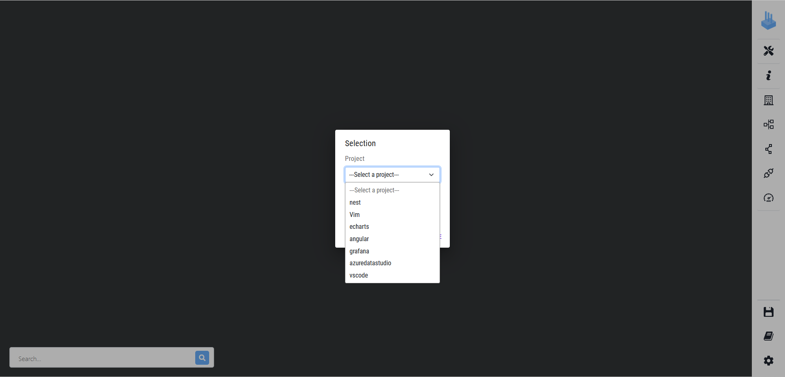
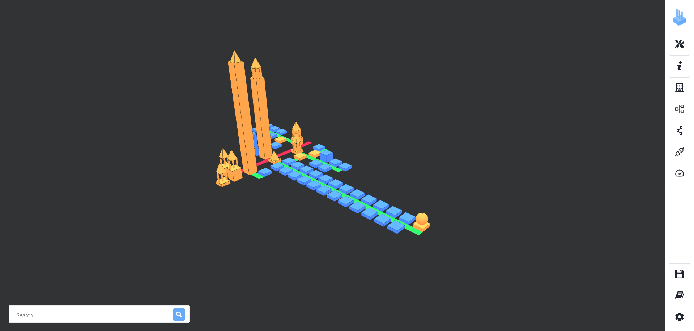

# Installation instructions

In this document, we assume that you already have a system with:
- a fully functional Docker and Docker Compose installed;
- a web browser (our tests have been made with Google Chrome, Mozilla Firefox and Edge).

See the `REQUIREMENTS.md` file for more details.

## Running VariCity-TS

All the scripts in this section are located and executed from the root of the VariCity-TS artifact.

### Reusing the existing Docker image

VariCity-TS is available as a Docker image hosted on the [Docker Hub](https://hub.docker.com/u/deathstar3),
allowing to use it without needing to build it.

Run VariCity-TS by running

- On GNU/Linux

    ```
    ./run-compose.sh
    ```

*Note:* Docker automatically downloads the image with the `scp2024` tag if it is not found on the host system.

You can also download it manually with:
```
docker pull deathstar3/varicity-ts:scp2024
docker pull deathstar3/varicity-ts-backend:scp2024
```

VariCity-TS is a NodeJS application written in TypeScript deployed in a webpack environment.
The Docker container exposes the application as a server, which is accessed through your web browser.

### Checking that VariCity-TS works

- Two Docker containers start:
  - `varicity`: the visualization server;
  - `varicity-backend`: a component exposing an endpoint receiving a symfinder analysis as soon as it is finished.

```
$ ./run-compose.sh
resources directory already exists
data directory already exists
dockervolume directory already exists
[+] Running 2/0
 ⠿ Container varicity-backend  Created                                                                                                                                                                                                  0.0s
 ⠿ Container varicity          Created                                                                                                                                                                                                  0.0s
Attaching to varicity, varicity-backend
varicity          | /docker-entrypoint.sh: /docker-entrypoint.d/ is not empty, will attempt to perform configuration
varicity          | /docker-entrypoint.sh: Looking for shell scripts in /docker-entrypoint.d/
varicity          | /docker-entrypoint.sh: Launching /docker-entrypoint.d/10-listen-on-ipv6-by-default.sh
varicity          | 10-listen-on-ipv6-by-default.sh: info: IPv6 listen already enabled
varicity          | /docker-entrypoint.sh: Launching /docker-entrypoint.d/20-envsubst-on-templates.sh
varicity          | /docker-entrypoint.sh: Launching /docker-entrypoint.d/30-tune-worker-processes.sh
varicity          | /docker-entrypoint.sh: Configuration complete; ready for start up
varicity          | 2022/06/06 14:13:20 [notice] 1#1: using the "epoll" event method
varicity          | 2022/06/06 14:13:20 [notice] 1#1: nginx/1.20.2
varicity          | 2022/06/06 14:13:20 [notice] 1#1: built by gcc 10.3.1 20210424 (Alpine 10.3.1_git20210424) 
varicity          | 2022/06/06 14:13:20 [notice] 1#1: OS: Linux 5.17.9-arch1-1
varicity          | 2022/06/06 14:13:20 [notice] 1#1: getrlimit(RLIMIT_NOFILE): 1048576:1048576
varicity          | 2022/06/06 14:13:20 [notice] 1#1: start worker processes
varicity          | 2022/06/06 14:13:20 [notice] 1#1: start worker process 25
varicity          | 2022/06/06 14:13:20 [notice] 1#1: start worker process 26
varicity          | 2022/06/06 14:13:20 [notice] 1#1: start worker process 27
varicity          | 2022/06/06 14:13:20 [notice] 1#1: start worker process 28
varicity          | 2022/06/06 14:13:20 [notice] 1#1: start worker process 29
varicity          | 2022/06/06 14:13:20 [notice] 1#1: start worker process 30
varicity          | 2022/06/06 14:13:20 [notice] 1#1: start worker process 31
varicity          | 2022/06/06 14:13:20 [notice] 1#1: start worker process 32
varicity          | 2022/06/06 14:13:20 [notice] 1#1: start worker process 33
varicity          | 2022/06/06 14:13:20 [notice] 1#1: start worker process 34
varicity          | 2022/06/06 14:13:20 [notice] 1#1: start worker process 35
varicity          | 2022/06/06 14:13:20 [notice] 1#1: start worker process 36
varicity-backend  | 
varicity-backend  | > varicity-backjs@0.0.1 start:prod
varicity-backend  | > node dist/main
varicity-backend  | 
varicity-backend  | [Nest] 18  - 06/06/2022, 2:13:20 PM     LOG [NestFactory] Starting Nest application...
varicity-backend  | [Nest] 18  - 06/06/2022, 2:13:20 PM     LOG [InstanceLoader] ConfigHostModule dependencies initialized +28ms
varicity-backend  | [Nest] 18  - 06/06/2022, 2:13:20 PM     LOG [InstanceLoader] ConfigModule dependencies initialized +0ms
varicity-backend  | [Nest] 18  - 06/06/2022, 2:13:20 PM     LOG [InstanceLoader] AppModule dependencies initialized +2ms
varicity-backend  | [Nest] 18  - 06/06/2022, 2:13:20 PM     LOG [RoutesResolver] ProjectController {/}: +167ms
varicity-backend  | [Nest] 18  - 06/06/2022, 2:13:20 PM     LOG [RouterExplorer] Mapped {/projects/names, GET} route +2ms
varicity-backend  | [Nest] 18  - 06/06/2022, 2:13:20 PM     LOG [RouterExplorer] Mapped {/projects/json/:name, GET} route +1ms
varicity-backend  | [Nest] 18  - 06/06/2022, 2:13:20 PM     LOG [RouterExplorer] Mapped {/projects/:name/metrics/external, GET} route +0ms
varicity-backend  | [Nest] 18  - 06/06/2022, 2:13:20 PM     LOG [RouterExplorer] Mapped {/projects/:name/metrics/variability, GET} route +0ms
varicity-backend  | [Nest] 18  - 06/06/2022, 2:13:20 PM     LOG [RouterExplorer] Mapped {/projects/:name/metrics, GET} route +1ms
varicity-backend  | [Nest] 18  - 06/06/2022, 2:13:20 PM     LOG [RouterExplorer] Mapped {/projects, POST} route +0ms
varicity-backend  | [Nest] 18  - 06/06/2022, 2:13:20 PM     LOG [RoutesResolver] ConfigController {/}: +1ms
varicity-backend  | [Nest] 18  - 06/06/2022, 2:13:20 PM     LOG [RouterExplorer] Mapped {/projects/configs, POST} route +0ms
varicity-backend  | [Nest] 18  - 06/06/2022, 2:13:20 PM     LOG [RouterExplorer] Mapped {/projects/configs/:configFile, POST} route +1ms
varicity-backend  | [Nest] 18  - 06/06/2022, 2:13:20 PM     LOG [RouterExplorer] Mapped {/projects/configs/names, GET} route +0ms
varicity-backend  | [Nest] 18  - 06/06/2022, 2:13:20 PM     LOG [RouterExplorer] Mapped {/projects/:projectName/configs, GET} route +1ms
varicity-backend  | [Nest] 18  - 06/06/2022, 2:13:20 PM     LOG [RouterExplorer] Mapped {/projects/configs/path, GET} route +0ms
varicity-backend  | [Nest] 18  - 06/06/2022, 2:13:20 PM     LOG [RouterExplorer] Mapped {/projects/configs, GET} route +1ms
varicity-backend  | [Nest] 18  - 06/06/2022, 2:13:20 PM     LOG [RouterExplorer] Mapped {/projects/configs/firstOrDefault, GET} route +0ms
varicity-backend  | [Nest] 18  - 06/06/2022, 2:13:20 PM     LOG [RouterExplorer] Mapped {/projects/:projectName/configs/filenames-and-names, GET} route +0ms
varicity-backend  | [Nest] 18  - 06/06/2022, 2:13:20 PM     LOG [NestApplication] Nest application successfully started +16ms
```
- Once the `Nest application successfully started` log appears, you can now open your web browser and go to [http://localhost:8000](http://localhost:8000).
- Click on the `Project` dropdown menu. A list of the available projects appears.

- By clicking on the desired project's name here Nest, a pre-configured view appears in the background. You can choose the view you want by clicking on the second dropdown menu.

- The `dockervolume/configs` directory contains a directory for each project, containing several pre-configured views. The Nest configuration matching the view presented in the paper as `Figure 4b` is labeled under `Varicity view - Figure 2`.
- By clicking on the view `Varicity view - Figure 2`, the city is loaded.

-The visualization above shows Nest with usage orientation set to OUT and usage level set to 2.

>Please note that the visualization may not be centered when appearing. The rendering time of the visualization increases with the number of buildings to display.
>To limit the loading time when switching between projects, we advise to reduce the value of the usage level to limit the number of buildings to render before switching.

### Building VariCity-TS

**This step is only needed if you edited VariCity-TS's source code.**

You can build VariCity-TS Docker images by running

```
./build_varicity_ts.sh 
```

Then, change the TAG variable in the `run-compose.sh` script from `scp2024` to `local`:

- On GNU/Linux, edit `run-compose.sh`
```
- export TAG=scp2024
+ export TAG=local
```

## Running a Symfinder-TS analysis

Reproducing the pre-generated visualizations is done by executing their analysis before visualizing it in VariCity-TS.
All scripts used in this section are located in the artifact's root directory.

### Reusing the existing Docker images

The following Docker images hosted on the [Docker Hub](https://hub.docker.com/u/deathstar3) allow to use Symfinder-TS without needing to build it.

```
deathstar3/symfinder-ts-cli
deathstar3/varicity-ts
deathstar3/varicity-ts-backend
```

In addition, running a Symfinder-TS analysis requires a Neo4j Docker image automatically pulled by the running script.

The Symfinder-TS cli uses Github links to run, example: `https://github.com/nestjs/nest`.  
Links to all studied projects are provided in `PROJECTS.md`

Running the analysis of one project is done as follows, here illustrated with the project [Nest](https://github.com/nestjs/nest):

- First, run the VariCity-TS server:

  - On GNU/Linux

  ```
  ./run-compose.sh
  ```

- Then, in another terminal:

  - On GNU/Linux

  ```
  ./run_symfinder_ts.sh https://github.com/nestjs/nest -runner docker -http http://varicity-backend:3000/projects 
  ```

*Notes:*
- Some analyses, such as Azure Data Studio, VS Code, Grafana or Angular can take multiple hours.
- The Docker images are automatically downloaded by Docker with the tag `scp2024` if they are not found on the host system.
If an image is not found, you can download it manually with the `docker pull` command.

Example:
```
docker pull deathstar3/symfinder-ts-cli:scp2024
```

### Checking that symfinder works
Hereafter, we illustrate the different steps of the execution of symfinder by giving excerpts of console outputs corresponding to the execution of symfinder on a single project, Nest.

1. First, a Neo4j database used to store information about the analyzed project (classes, methods, identified variation points and variants…) is started.
```
$ ./run_symfinder_ts.sh https://github.com/nestjs/nest -runner docker -http http://varicity-backend:3000/projects 
Starting database container
Starting Docker
eaca35274582889c1ea467e57b7248ee4d8414e45fdd82b59d7cadc268ec4d5d
Database running, starting engine container
```

2. Then, symfinder clones the repository of the analyzed project. It is downloaded and then unziped, the operation can take a certain amount of time.
```
https://github.com/nestjs/nest
-runner
-http
Path to server manually defined.
HTTP_PATH : http://varicity-backend:3000/projects
Project "https://github.com/nestjs/nest" will be analyse.
Project results will be send to server "http://varicity-backend:3000/projects"
Download at https://github.com/nestjs/nest
Anlysing project: nest
HTTP : http://varicity-backend:3000/projects
PROJECT : experiments/nest
RUNNER: docker
Sending result to http://varicity-backend:3000/projects ...
```

3. Once cloned, the symfinder engine parses the codebase of the project and populates the Neo4j database. This is the longest part of the analysis. Small projects like Nest, Vim or Echarts only take several minutes to be analyzed whereas big ones like Azure Data Studio take several hours.
```
Database ready.                                               
Analyse variability in : 'experiments/nest'
Folder 'test' exclude...                                                            
Folder 'test' exclude...                                                            
Folder 'testing-module-override' exclude...                                                            
Folder 'test' exclude...                                                            
Folder 'test' exclude...                                                            
Folder 'test' exclude...                                                            
Folder 'test' exclude...                                                            
Folder 'test' exclude...                                                            
Folder 'testing' exclude...                                                            
Folder 'test' exclude...                                                            
Folder 'test' exclude...                                                            
Folder 'test' exclude...                                                            
Detecting files (1198): done.
Resolving classes: 100% (1198/1198), done.
Resolving relations: 100% (1198/1198), done.
Resolving strategies: 100% (1198/1198), done.
Resolving usages: 26% (309/1198)experiments/nest/integration/send-files/e2e/utils.ts > Error to link 'usage' nodes url and URL...
experiments/nest/integration/send-files/e2e/utils.ts > Error to link 'usage' nodes req and ClientRequest...
experiments/nest/integration/send-files/e2e/utils.ts > Error to link 'usage' nodes req and ClientRequest...
Resolving usages: 56% (670/1198)experiments/nest/packages/core/repl/repl-native-commands.ts > Error to link 'usage' nodes replServer and REPLServer...
experiments/nest/packages/core/repl/repl-native-commands.ts > Error to link 'usage' nodes replServer and REPLServer...
Resolving usages: 65% (775/1198)experiments/nest/packages/microservices/helpers/json-socket.ts > Error to link 'usage' nodes stringDecoder and StringDecoder...
Resolving usages: 100% (1198/1198), done.
Resolving decorators, factories, templates: 100% (1198/1198), done.
data written to fileCREATE PROJECT JSON : 

################Sending request ...
```
Five visitors are run on the codebase: `ClassesVisitor`, `GraphBuilderVisitor`, `DecoratorFactoryTemplateVisitor`, `StrategyVisitor`, and `UsageVisitor`.

3. At the end of the successive parsings, a summary of the results of the execution is given, and symfinder stops, the container is deleted but Database container is running so you can access it on [http://localhost:7474/browser/](http://localhost:7474/browser/) and explore the data.
The information are then sent to the VariCity-TS backend.
```
data written to fileData has been correctly sent
Sent to server http://varicity-backend:3000/projects
db fetched
Number of VPs: 405
Number of methods VPs: 50
Number of constructor VPs: 3
Number of method level VPs: 53
Number of class level VPs: 352
Number of variants: 378
Number of methods variants: 160
Number of constructors variants: 11
Number of method level variants: 171
Number of class level variants: 207
Number of nodes: 15099
Number of relationships: 19858
Duration: 00:00:53.8
Number of unknown class path: 0.45% (4/876)
```

5. Supposing that you run symfinder on Nest only, the `/dockervolume/data` directory shall now have the following structure:
```
/data/symfinder_files/
└── parsed
    ├── nest.json
└── nest.json    
```
Files in the `symfinder_files` directory (`nest.json`) correspond to files generated by analysing Nest with symfinder.

### Building symfinder

**This step is only needed if you edited Symfinder-TS source code.**

You can build Symfinder-TS Docker images by running

```
./build_symfinder_ts.sh
```

Then, change the TAG variable in the `run-docker-cli` script from `scp2024` to `local`:

- On GNU/Linux, edit `run-docker-cli.sh`
```
- TAG=scp2024
+ TAG=local
```

### Troubleshooting known issues

#### Common issues

- Before Symfinder starts analyzing the project, it establishes connection with the database. It is possible that you see this error in the log
```
Data base not ready... Retrying in 5 sec (0/10)Neo4jError: Failed to connect to server. Please ensure that your database is listening on the correct host and port and that you have compatible encryption settings both on Neo4j server and driver. Note that the default encryption setting has changed in Neo4j 4.0. Caused by: connect ECONNREFUSED 172.18.0.4:7687

    at captureStacktrace (/app/node_modules/neo4j-driver-core/lib/result.js:239:17)
    at new Result (/app/node_modules/neo4j-driver-core/lib/result.js:59:23)
    at newCompletedResult (/app/node_modules/neo4j-driver-core/lib/transaction.js:433:12)
    at Object.run (/app/node_modules/neo4j-driver-core/lib/transaction.js:287:20)
    at Transaction.run (/app/node_modules/neo4j-driver-core/lib/transaction.js:137:34)
    at NeoGraph.<anonymous> (/app/lib/neograph/NeoGraph.js:1196:58)
    at step (/app/lib/neograph/NeoGraph.js:33:23)
    at Object.next (/app/lib/neograph/NeoGraph.js:14:53)
    at /app/lib/neograph/NeoGraph.js:8:71
    at new Promise (<anonymous>) {
  constructor: [Function: Neo4jError],
  code: 'ServiceUnavailable'
}
```
The problem should be fixed after two or three retry.
If it reaches 10, the program execution stops. In this case make sure that you are using the argument `runner` with the value `docker` if executing the script `run_symfinder_ts.sh` and the value `local` if executing the script `run.sh`. 

- If you obtain the following message:
```
Cannot connect to the Docker daemon at unix:///var/run/docker.sock. Is the docker daemon running?
```
This means that the Docker service is not running on your machine. Start the Docker service.

- If you obtain the following message:
```
ERROR: for <container_name>  Cannot create container for service <container_name>: Conflict. The container name "<container_name>" is already in use by container "XXXX". You have to remove (or rename) that container to be able to reuse that name.
```
You need to remove the container whose name is already in use.
```
$ docker stop <container_name>
$ docker rm <container_name>
```