# Customizable Visualization of Quality Metrics for Object-Oriented Variability Implementations
## Artifact Track submission

### Johann Mortara – Philippe Collet – Anne-Marie Dery-Pinna

This artifact submission goes with the paper "Customizable Visualization of Quality Metrics for Object-Oriented Variability Implementations" accepted in the Research Track of SPLC 2022.

## Artifact description

The artifact consists of two archives:

### Current archive

The current archive is organized as follows:
```
.
├── images/
├── INSTALL.md
├── jfreechart_sources/
│   ├── jfreechart-1.5.0.zip
│   ├── jfreechart-after-maintenance.zip
│   └── versions_diff.txt
├── LICENSE.md
├── README.md
├── REQUIREMENTS.md
├── tables_data/
    ├── sonarqube_reports/
    │   ├── jfreechart-1.5.0/
    │   ├── jfreechart-after-maintenance/
    └── table_2.xlsx
```

- `INSTALL.md`: VariMetrics and symfinder installation instructions
- `LICENSE.md`: license file
- `README.md`: documentation to reproduce the results of the paper and to reuse VariMetrics on other projects
- `REQUIREMENTS.md`: technical requirements to use VariMetrics

The `tables_data` directory contains:
- `table_2.xlsx`: Excel file used to obtain the data presented in the table 2 of the paper
- `sonarqube_reports`: excerpts of SonarQube reports used to obtain the data presented in the table 3 of the paper

The `jfreechart_sources` directory contains:
- `jfreechart-after-maintenance.zip`: JFreeChart 1.5.0 after applying maintenance actions, studied in the qualitative evaluation (section 5.2 of the paper);
- `jfreechart-original.zip`: original sources of JFreechart 1.5.0
- `versions_diff.txt`: diff between the two codebases to visualize the applied modifications


### VariMetrics artifact

**Accessible at DOI: [https://doi.org/10.5281/zenodo.6644449](https://doi.org/10.5281/zenodo.6644449)** 

This artifact contains:

- the source code of VariMetrics, the visualization presented in the paper.
VariMetrics relies on data from symfinder, whose source code is also present in the artifact archive.
- symfinder configuration files to analyze the projects studied in the paper
- the `dockervolume.zip` archive present at the root of the artifact archive contains data used to generate visualizations for all 7 subject systems presented in the Table 2 of the paper and the refactored version of JFreeChart:
  - pre-generated outputs from the symfinder analyses
  - pre-configured visualizations


## Reproducing the results presented in the paper

### A. Preparing your host system

Set up your host system according to the guidelines given in the `REQUIREMENTS.md` file.

**Note:** your Docker daemon must be running in order to use VariMetrics.  

### B. Getting the sources

1. Download the archive available at [https://doi.org/10.5281/zenodo.6644449](https://doi.org/10.5281/zenodo.6644449)
2. Unzip the archive. You should obtain the following hierarchy (only the files useful for the reproduction are shown):
```
varimetrics_reproduction-package/
├── build-docker-images.bat
├── build-docker-images.sh
├── data/
│   ├── argouml.yaml
│   ├── azureus.yaml
│   ├── geotools.yaml
│   ├── jdk.yaml
│   ├── jfreechart-1.5.0.yaml
│   ├── jfreechart-refactored.yaml
│   ├── jkube.yaml
│   ├── openapi-generator.yaml
│   ├── spring.yaml
│   └── symfinder.yaml
├── dockervolume.zip
├── run-compose.bat
├── run-compose-detach.sh
└── run-compose.sh
```
In the remaining of this guide, we will refer to `varimetrics_reproduction-package` as the root of the project.
For example, `/data` represents the `varimetrics_reproduction-package/data` directory.

### C. Creating the cities with VariMetrics using the pre-generated visualizations files

The files generated by symfinder and the data extracted from SonarCloud/SonarQube analyses used by VariMetrics to create the cities for the 7 projects presented in table 2 of the paper are available in the `dockervolume.zip` archive.

1. Unzip the `dockervolume.zip` archive to obtain the following hierarchy (only the files useful for the reproduction are shown):
```
dockervolume/
├── configs/
|   ├── azureus/
|   │   ├── config-azureus-10.yaml
|   │   └── config-azureus-4.yaml
|   ├── geotools/
|   │   ├── config-geotools-14.yaml
|   │   └── config-geotools-5.yaml
|   ├── jdk-17.10/
|   │   ├── config-jdk-17.10-20.yaml
|   │   └── config-jdk-17.10-21.yaml
|   ├── jfreechart-1.5.0/
|   │   ├── config-jfreechart-1.5.0-17.yaml
|   │   ├── config-jfreechart-1.5.0-18.yaml
|   │   ├── config-jfreechart-1.5.0-21.yaml
|   │   ├── config-jfreechart-1.5.0-22.yaml
|   │   ├── config-jfreechart-1.5.0-3.yaml
|   │   └── config-jfreechart-1.5.0-8.yaml
|   ├── jfreechart-refactored/
|   │   ├── config-jfreechart-refactored-20.yaml
|   │   ├── config-jfreechart-refactored-22.yaml
|   │   ├── config-jfreechart-refactored-23.yaml
|   │   └── config-jfreechart-refactored-24.yaml
|   ├── jkube/
|   │   └── config-jkube-9.yaml
|   ├── openapi-generator/
|   │   └── config-openapi-generator-12.yaml
|   └── spring/
|       ├── config-spring-15.yaml
|       └── config-spring-7.yaml
├── data/
│   └── symfinder_files/
│       ├── argouml.json
│       ├── azureus.json
│       ├── externals
│       │   ├── sonarcloud
│       │   │   ├── argouml-sonarcloud.json
│       │   │   ├── azureus-sonarcloud.json
│       │   │   ├── geotools-sonarcloud.json
│       │   │   ├── jdk-17.10-sonarcloud.json
│       │   │   ├── jkube-sonarcloud.json
│       │   │   ├── openapi-generator-sonarcloud.json
│       │   │   └── spring-sonarcloud.json
│       │   └── sonarqube
│       │       ├── jfreechart-1.5.0-sonarqube.json
│       │       └── jfreechart-refactored-sonarqube.json
│       ├── geotools.json
│       ├── jdk-17.10.json
│       ├── jfreechart-1.5.0.json
│       ├── jfreechart-refactored.json
│       ├── jkube.json
│       ├── openapi-generator.json
│       ├── parsed
│       │   ├── argouml.json
│       │   ├── azureus.json
│       │   ├── geotools.json
│       │   ├── jdk-17.10.json
│       │   ├── jfreechart-1.5.0.json
│       │   ├── jfreechart-refactored.json
│       │   ├── jkube.json
│       │   ├── openapi-generator.json
│       │   └── spring.json
│       └── spring.json
└── varicitydb.json
```
The `dockervolume/configs` directory contains the configurations for the views for each project.
The `dockervolume/data` directory contains the symfinder outputs for each project.

2. Run VariMetrics by running


- On GNU/Linux and macOS

    ```
    ./run-compose.sh
    ```

- On Windows

    ```
    run-compose.bat
    ```
  
For more information on the execution of VariMetrics, see `INSTALL.md`.

3. Open your web browser and go to `http://localhost:8000`
4. Click on the `Project` dropdown menu. A list of the available projects appears.
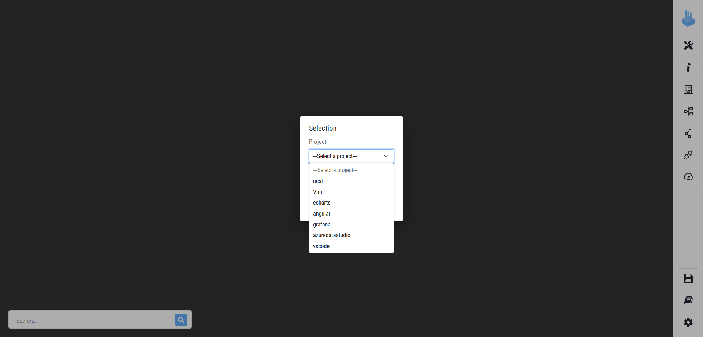
5. By clicking on the desired project's name, the visualization appears on the left, here JFreeChart.
Please note that the visualization may not be centered when appearing. The rendering time of the visualization increases with the number of buildings to display.
To limit the loading time when switching between projects, we advise to reduce the value of the usage level to limit the number of buildings to render.
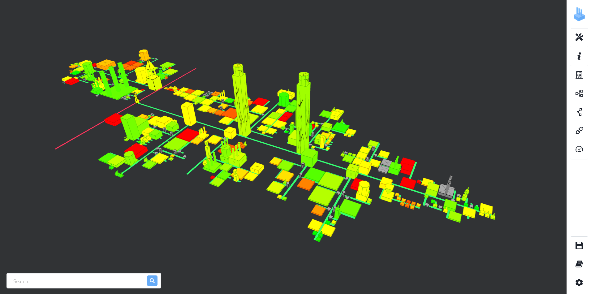
The visualization above shows JFreeChart with usage orientation set to OUT and usage level set to 4.
6. The `dockervolume/configs` directory contains a directory for each project, containing the configurations presented in Table 2 of the paper, with and without the quality metrics. JFreeChart and its refactor have extra configurations showing the camera settings presented in figures 5 to 8.
More details about the different configuration options are present in the `README.md` file present in the artifact's root directory.

### D. Generating the visualizations files with symfinder

The VariMetrics artifact contains in the `/data` directory the configurations for the 7 systems presented in the paper + JFreeChart's refactor.
- `azureus.yaml` → [Azureus 5.7.6.0](https://github.com/Corpus-2021/Azureus/tree/5.7.6.0)
- `geotools.yaml` → [GeoTools 23.5](https://github.com/Corpus-2021/geotools/tree/23.5-AnalysisReady)
- `jdk.yaml` → [JDK 17-10](https://github.com/Corpus-2021/jdk/tree/17-10-AnalysisReady)
- `jfreechart-1.5.0.yaml` → [JFreeChart 1.5.0](https://github.com/DeathStar3/jfreechart)
    - `jfreechart-refactored.yaml` → [JFreeChart 1.5.0](https://github.com/DeathStar3/jfreechart/tree/refactor) after the maintenance actions studied in section 5.2
- `jkube.yaml` → [JKube 1.7.0](https://github.com/eclipse/jkube)
- `openapi-generator.yaml` → [OpenAPI Generator 5.4.0](https://github.com/OpenAPITools/openapi-generator)
- `spring.yaml` → [Spring framework 5.2.3](https://github.com/Corpus-2021/spring-framework/tree/5.2.13-AnalysisReady)

To generate the visualization files for a project, go to the root of the project and run symfinder as detailed in the "Running a symfinder analysis" section of the `INSTALL.md` file.

*Notes:* Some analyses, such as the JDK, GeoTools or Azureus can take multiple hours.
We advise, for a quick evaluation of the toolchain's capabilities, to analyse smaller projects (e.g. JFreeChart, JKube or OpenAPI Generator).

## Reusing VariMetrics and symfinder on other projects

To analyse a project, you will need to:
- create a symfinder configuration file similar to the ones present in the `/data` directory. The documentation of the symfinder configuration files available in the "Experiment configuration documentation" section of the `/symfinder/README.md` file.
- configure the VariMetrics visualization.

For demonstration purposes, the `/data` directory contains symfinder configuration files for two other projects for you to try VariMetrics on.
- `junit-r4.13.2-config.yaml` → [JUnit 4.13.2](https://github.com/junit-team/junit4/tree/r4.13.2), metrics fetched from a local SonarQube server
- `nekohtml.yaml` → [NekoHTML 2.1.1](https://github.com/Corpus-2021/nekohtml/tree/2.1.1-AnalysisReady), metrics fetched from its [SonarCloud page](https://sonarcloud.io/summary/overall?id=corpus2021.sonar%3Anekohtml)

Hereafter we will detail the steps to configure a view on one of these systems, NekoHTML.

Let's execute symfinder on NekoHTML.

- In one terminal

```
./run-compose.sh
```

- In another terminal
```shell
./run-docker-cli.sh -i /data/nekohtml.yaml -s /data/symfinder.yaml -verbosity INFO -http http://varicityback:3000/projects
```

After the execution of the symfinder analysis, go on `http://localhost:8000` and select the `nekohtml-2.1.1` project.

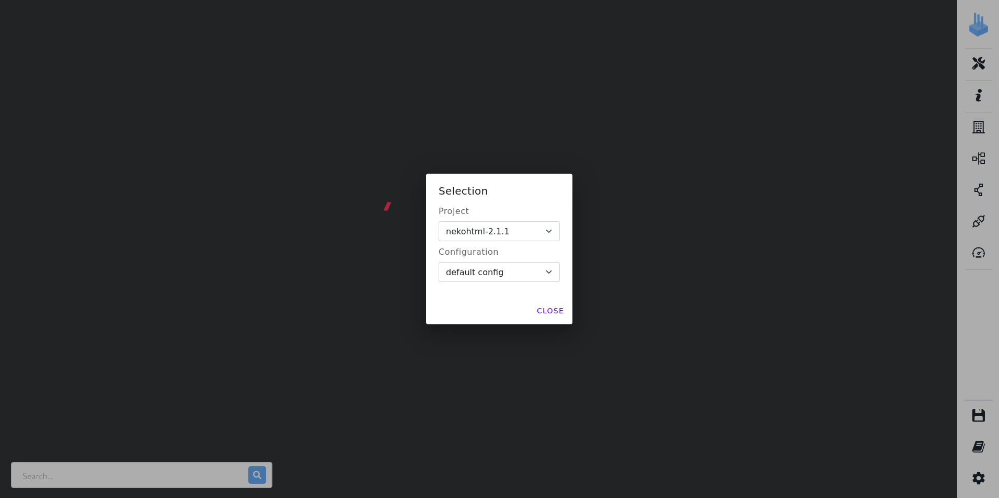

A unique view configuration is available, called `default config`, showing an empty visualization.

Close the popup. On the sidebar, click on the `APIs and Blacklist` button.


In the `API classes` field, start typing `HTMLScanner`, and select `org.codelibs.nekohtml.HTMLScanner`.

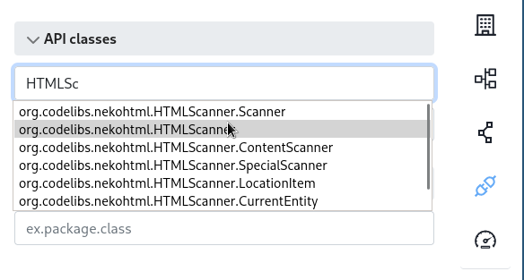

Press Enter, a visualization should appear.

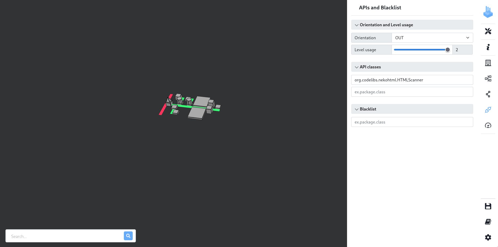

Let's tune the orientation and usage level to change them to show both incoming and outgoing classes (orientation IN_OUT) on 4 levels of usages (usage level 4). More classes appear.

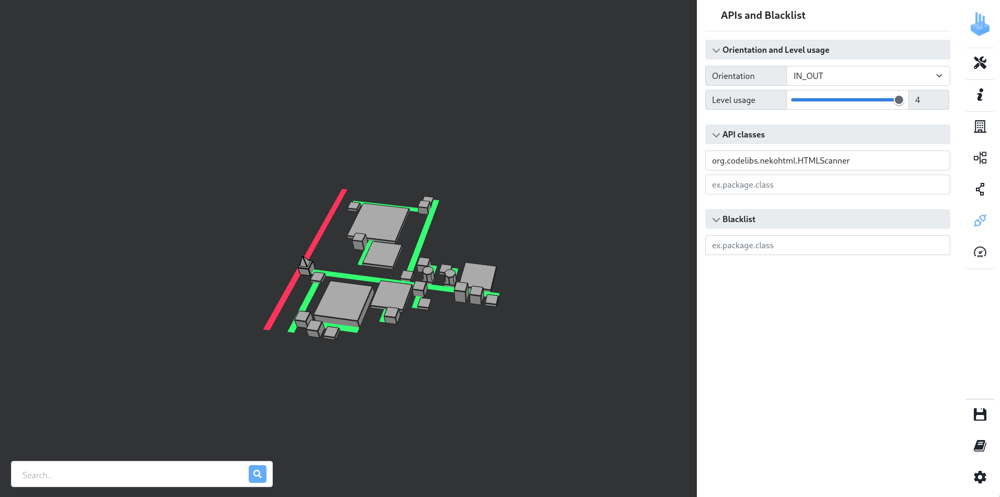

This visualization is the standard VariCity one.
To add metrics on the visualization, on the sidebar, click on the `Metrics` button.

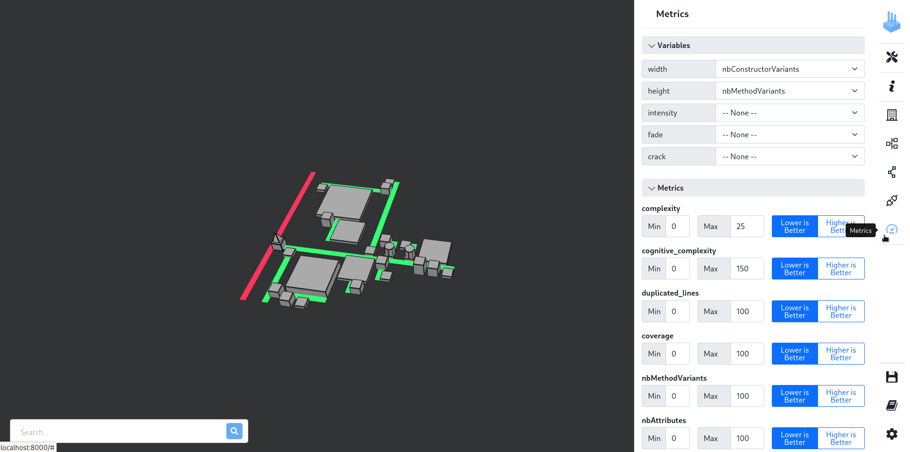

The three additional visualization axes compared to VariCity are intensity (color saturation), fade (red-green scale) and crack (crackled texture).
Let's display the cognitive complexity on the red-green scale.

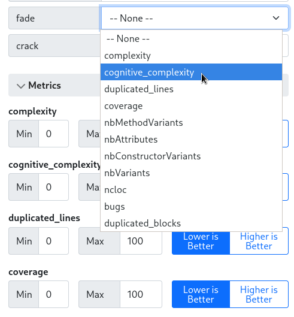

We obtain the following visualization.

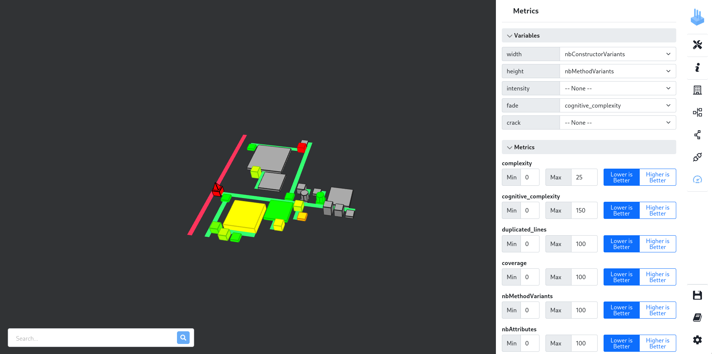

Let's now add the coverage using the crackled texture.

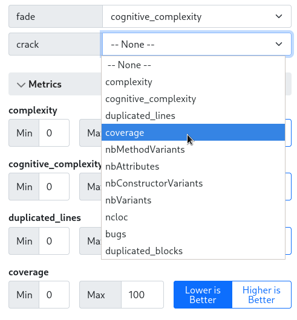

Since a high coverage is a sign of good quality, we select the `Higher is Better` option.

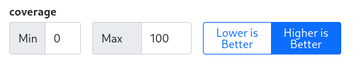

We obtain the following visualization. Classes for which we don't have the coverage have metrics have a cross on their building.

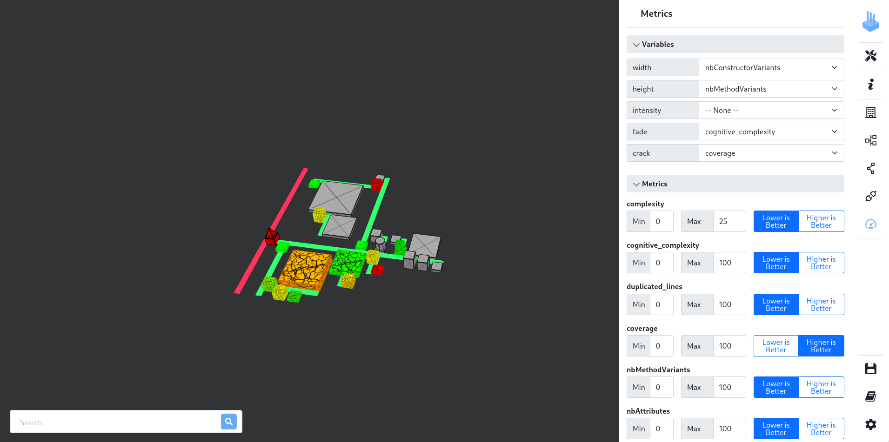

We can zoom on the visualization to better see the results.
We notice a large class (therefore possessing multiple constructors) and although it seems relatively complex (as it appears orange,) it exhibits little coverage by appearing very cracked.

By clicking on this class, the `Information` panel opens to give us information about it.

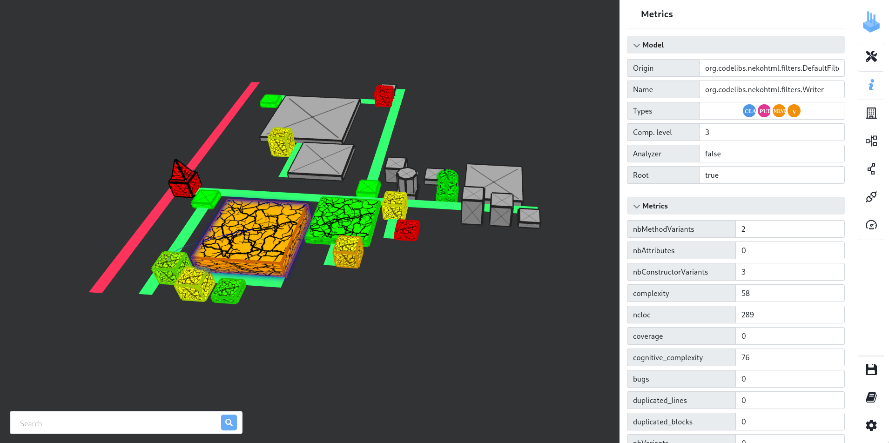

This class is [`org.codelibs.nekohtml.filters.Writer`](https://github.com/Corpus-2021/nekohtml/blob/2.1.1-AnalysisReady/src/main/java/org/codelibs/nekohtml/filters/Writer.java), whose goal is to print an HTML content to an output stream.
The three constructors allow to write on different outputs (standard output, Java `OutputStream` or Java `Writer`), therefore exhibiting variability.
The class is not covered (coverage of 0%) despite having a relatively high cognitive complexity of 76.

## Detailed README

A more exhaustive documentation on
- the capabilities of the VariMetrics visualization
- the configuration of a symfinder analysis
- the technical organization of the toolchain
is available in the `README.md` file at the root of the [VariMetrics artifact's archive](https://doi.org/10.5281/zenodo.6644449), that itself points to other documentations.
