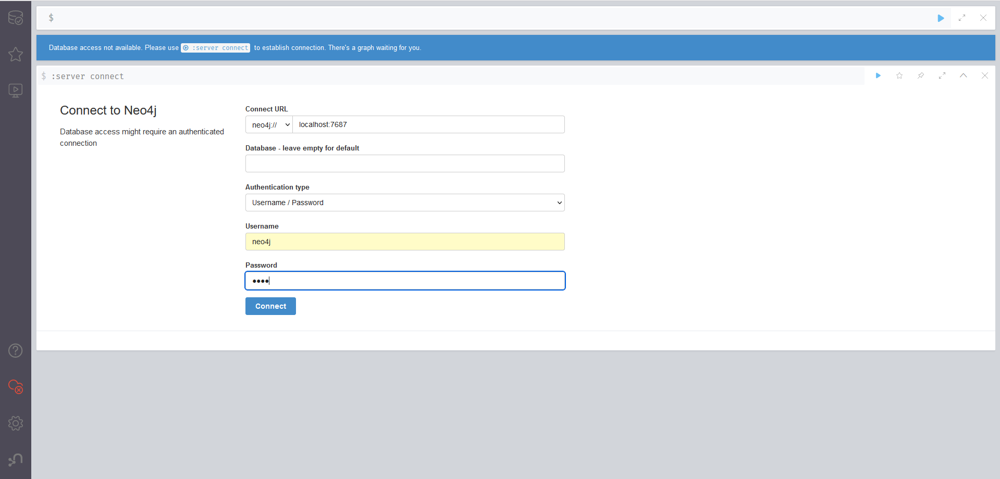
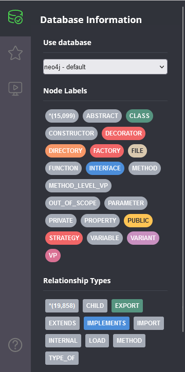
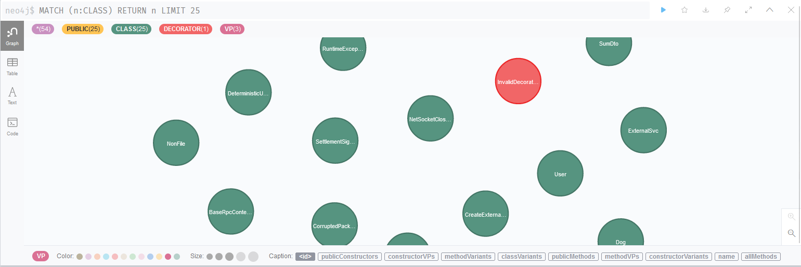
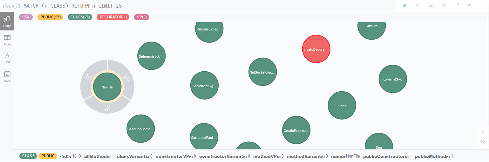
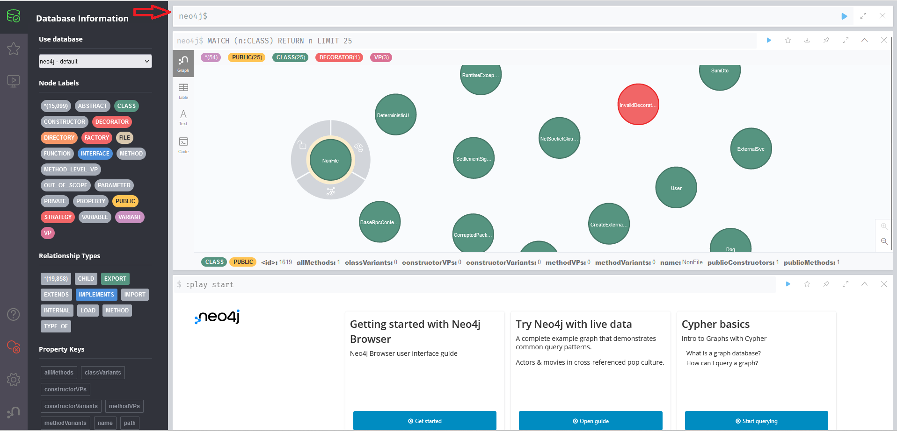

# Symfinder-TS

**Symfinder-TS** is a toolchain parsing a single TypeScript codebase to identify potential variability implementations.
The analysis of Symfinder-TS is paired with a Neo4J Graph database which is populated with all variability implementations found in the source code.
The output of Symfinder-TS consist in JSON files containing information on the presence of variability implementations in the analysed codebase (e.g. if a class has been identified as a variation point or a variant, number of variants of an identified variation point…).
The output is then sent to the VariCity-TS-backend which parse it and makes it accessible through the VariCity-TS UI to visualize it as a 3D City.

## Technical Requirements

- Docker
    - Instructions to install Docker are available [here](https://docs.docker.com/get-docker/).
- Docker Compose
    - Instructions to install Docker Compose are available [here](https://docs.docker.com/compose/install/#install-compose).
- Docker with WSL2 on Windows
    - Instruction to install Docker are available [here](https://learn.microsoft.com/en-us/windows/wsl/tutorials/wsl-containers)

**Note:** By default, on a GNU/Linux host, Docker commands must be run using `sudo`. Two options are available for you in order to run the project:
- Follow [these short steps](https://docs.docker.com/install/linux/linux-postinstall/#manage-docker-as-a-non-root-user) to allow your user to call Docker commands,
- Preface the scripts calls with `sudo`.


## Running Symfinder-TS

Symfinder can run as a Docker container or locally on your machine.  
In both cases the Symfinder engine runs along a Neo4J database that is always in a container.

Symfinder-TS works with Github URLs to analyse projects. The URL is used to download the project archive. 

*Note*: **The required URL is the web page URL not the http cloning URL**

### Reusing the existing Docker image

All scripts mentioned in this section are not located in the folder containing this readme.  
They are located and executed from the root of the VariCity-TS folder.

_The procedure is here illustrated with the project [NestJS](https://github.com/nestjs/nest)_

The following Docker images hosted on [Docker Hub](https://hub.docker.com/) allow to use VariCity-TS without needing to build it.

```
deathstar3/symfinder-ts-cli
deathstar3/varicity-ts
deathstar3/varicity-ts-backend
```

- First run VariCity-TS:

    - On GNU/Linux

    ```
    ./run-compose.sh
    ```

- Then, in another terminal:

  - On GNU/Linux

  ```
  ./run_symfinder_ts.sh https://github.com/nestjs/nest -runner docker -http http://varicity-backend:3000/projects 
  ```

  - What does the command do ?

    - `./run_symfinder_ts.sh` is the script needed to run the docker version of Symfinder-TS. It is located at the root of the folder `VariCity-TS`. It is a combined script that runs both the Neo4J database container and the Symfinder-TS container.
    - `https://github.com/nestjs/nest` -> The first argument is the Github URL of the project to analyse. 
    - `-runner docker` -> The second argument specifies if the engine is running on Docker or on a local machine 
    - `-http http://varicity-backend:3000/projects` -> The third argument is the address with which the engine can communicate the analysis data to the VariCity-TS-backend. As they are part of the same Docker network the URL in directly the container hostname.

  *Note:* As for VariXity-TS, the Docker image is automatically downloaded by Docker with the tag `scp2024` if it is not found on the host system.


### Building Symfinder-TS

**This step is only needed if you edited Symfinder-TS source code.**

You can build Symfinder-TS Docker images by running

```
./build_symfinder_ts.sh
```

Then, change the TAG variable in the `run_symfinder_ts.sh` script from `scp2024` to `local`:

- On GNU/Linux, edit `run_symfinder_ts.sh`
```
- TAG=scp2024
+ TAG=local
```

### Running Symfinder-TS on local machine

Scripts mentioned in this section are not all located nor executed in the folder containing this readme.  

#### Dependencies

This is a node/npm project that uses Typescript. 

**Note**: It runs on Node 16.

All dependencies are specified in the **package.json** file and can be installed with by running the script `./prepare.sh`.

- On GNU/Linux

    ```
    ./prepare.sh
    ```

#### Procedure

_The procedure is here illustrated with the project [NestJS](https://github.com/nestjs/nest)_

- First, at the root of the VariCity-TS folder

    - On GNU/Linux

        ```
        ./run-compose.sh
        ```

- Then, in another terminal, in the js folder

    - GNU/Linux
        ```
        ./run.sh https://github.com/nestjs/nest -runner local -http
        ```

  - What does the command do ?

    - `./run.sh` is the script needed to run the lcoal version of Symfinder-TS. It is a combined script that runs both the Neo4J database container and the Symfinder-TS engine.
    - `https://github.com/nestjs/nest` -> The first argument is the Github URL of the project to analyse. 
    - `-runner local` -> The second argument specifies if the engine is running on Docker or on a local machine 
    - `-http` -> The third argument is the address with which the engine can communicate the analysis data to the VariCity-TS-backend. No specific URL is specified here which means the default URL is used.

## Using Symfinder-TS

- Once the analysis is finished you can go at the address [http://localhost:7474/browser/](http://localhost:7474/browser/) is your browser to access the graph database and explore it. 



*Note*: Username and Password might not be autocompleted. Username is `neo4j`and password is `root`. 

- Once connected, click on the database icon at the top left  


- This opens a side panel with all node labels registered in the database and all relationship types as well. 



- Clicking on one label opens a request panel with all node registered with the label. 

*Note*: You can modify the color, the size and the caption of all nodes and relations when clicking on it when inside a request panel.



- By hovering a node, all information are displayed at the bottom of the request panel (all labels and variability metrics.)


- By clicking on a node, you can fix his position, dismiss it or expand it to show all related node.



- Finally, Neo4J uses the [Cypher query language](https://neo4j.com/docs/getting-started/cypher-intro/). Feel free to run all the queries you want on the browser to explore the analysis data. Queries are to be run in the top bar



**Important Note**: The Neo4J database **ONLY** contains the data of the last analyzed project. Let's say you analyze Nest, then you analyze Vim and finally you go on the web to explore your data, you will be exploring Vim database. You will have to run a new analysis on Nest to access its analysis data.
