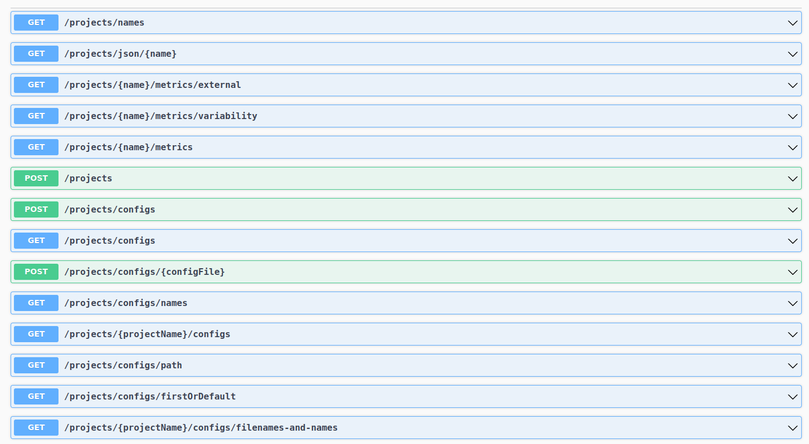

# VariCity-TS-backend

The VariCity-TS-backend is a REST service that stores and pre-parse the results extracted by Symfinder. It also stores the Visualization Configurations.

Here is a list of the available routes.

The swagger documentation is accessible at the link [http://localhost:3000/api/](http://localhost:3000/api/) **only when the container is running**

<p align="center">
  
</p>

### Running VariCity-TS-backend

The backend is not supposed to run alone. It is meant to run along with VariCity-TS to visualize 3D cities of variability.
Please refer to the [readme](../README.md) at the root of the project to run VariCity-TS.


### Building VariCity-TS-backend

**This step is only needed if you edited varicity-backend source code.**

  - On GNU/Linux

  ```
  ./build.sh
  ```

  _Note that if you also intend to modify the source code of VariCity-TS, you can rebuild both images by running the script `build_varicity_ts.sh` at the root of the project._

  Then, change the TAG variable in the `run-compose` script from `scp2024` to `local`:

- On GNU/Linux, edit `run-compose.sh`
```
- export TAG=scp2024
+ export TAG=local
```

### Run local on your machine

>If you want to develop the backend, you will need the following
>- Node 16
>- NPM 7.10


__Installation__

```bash
$ npm install
```

__Running the app__

```bash
# development
$ npm run start

# watch mode
$ npm run start:dev

# production mode
$ npm run start:prod
```


### VariCity-TS-backend configuration
Here is the list of environment variables you can use to change the behavior of VariCity-TS-backend
You can modify their default values in the `.env` or by setting an environment variable with the same names.

```properties
PERSISTENT_DIR=./persistent
SYMFINDER_DIR=./persistent/data/symfinder_files
METRICS_DIR=./persistent/data/symfinder_files/externals
PARSED_INPUT_DIR=./persistent/data/symfinder_files/parsed
DATABASE_PATH=./persistent/varicitydb
VISUALISATION_CONFIGS_PATH=./persistent/configs
DEFAULT_CONFIGS_DIR=./persistent/default-configs
WATCH_DIRECTORIES=1
WATCHED_CONFIGS_DIR=./persistent/manual/configs
WATCHED_SYMFINDER_DIR=./persistent/manual/symfinder_files
```

__Description of some variables__

| Environment variables | Type   | Description                                                                                                                                                                                          |
| --------------------- | ------ | ---------------------------------------------------------------------------------------------------------------------------------------------------------------------------------------------------- |
| WATCH_DIRECTORIES     | int    | Whether or not to use a file watcher to index new configs or experiments you might add , default value is 1 meaning true, put it to 0 to deactivate the file watcher                                 |
| WATCH_DIRECTORIES     | string | The directory where you can put your new configs manually. If you place a config there it will be picked up by the file watcher if it is activated                                                   |
| WATCHED_SYMFINDER_DIR | string | The directory where you can put your symfinder_files manually. If you also have the metrics file of your project place them in `METRICS_DIR` **before** placing the result of the symfinder_analysis |
| PARSED_INPUT_DIR      | string | When a symfinder_analysis is posted to Varicity Backend or detected by the file watcher it will be parsed and the result will be save in `PARSED_INPUT_DIR`                                            |
### Technological stack
VariCity-TS-backend was developped with the Nestjs.
<p align="center">
  <a href="http://nestjs.com/" target="blank"></a>
</p>

[circleci-image]: https://img.shields.io/circleci/build/github/nestjs/nest/master?token=abc123def456
[circleci-url]: https://circleci.com/gh/nestjs/nest

  <p align="center">A progressive <a href="http://nodejs.org" target="_blank">Node.js</a> framework for building efficient and scalable server-side applications.</p>
    <p align="center">